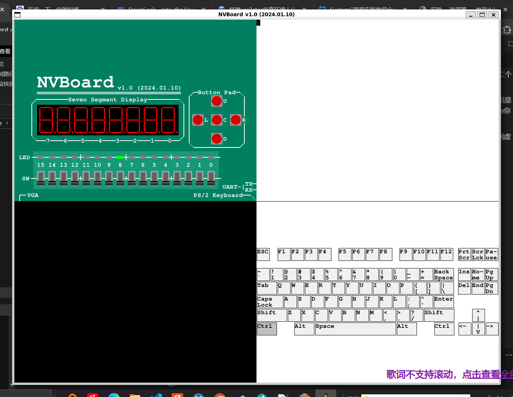

该项目将light流水灯项目连接到nvboard上.


流程: 详见nvboard文档.

首先, 建立这样的文件结构:
.
├── vsrc
│   └── top_name.v
├── csrc
│   └── 名称无要求.cpp
├── constr
│   └── top_name.nxdc
└── Makefile

* 其中,top_name.v的格式就那样, 不需要写仿真模块, 输入输出必须是wire.

* 其中,top_name.cpp的格式是直接抄袭nvboard文件夹的example项目的.

* 其中, .nxdr的格式参考文档. 绑定好你的.v文件夹输入输出信号到FPGA板子上.


* 然后在constr/目录下运行来自nvboard提供的自动生成约束.cpp文件的py脚本`auto_bind.cpp`:
```bash
   python3 $NVBOARD_HOME/scripts/auto_pin_bind.py ./light.nxdc ../auto_bind.cpp
```
从而在主目录生成`auto_bind.cpp`. 


该命令参数:
* `$NVBOARD_HOME/scripts/auto_pin_bind.py` 运行的朋py脚本
* `./light.nxdc`接收的第一个参数: 约束文本
* `../auto_bind.cpp`接收的1第二个参数: 目标文件


* 其中, Makefile的格式也直接抄, 但是要改一下里面的TOPNAME名字为你的顶层模块名.
* 运行make run规则, 把程序烧录到虚拟FPGA板子上.

* 运行结果: 你会看到一个流水灯:
  


